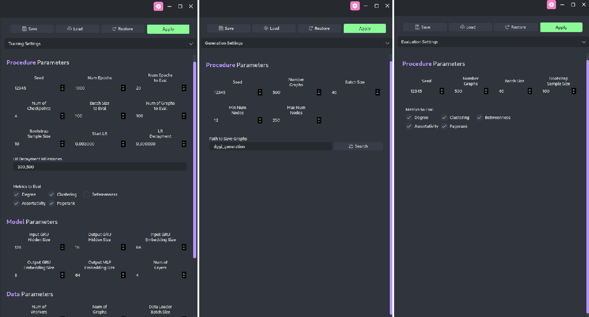
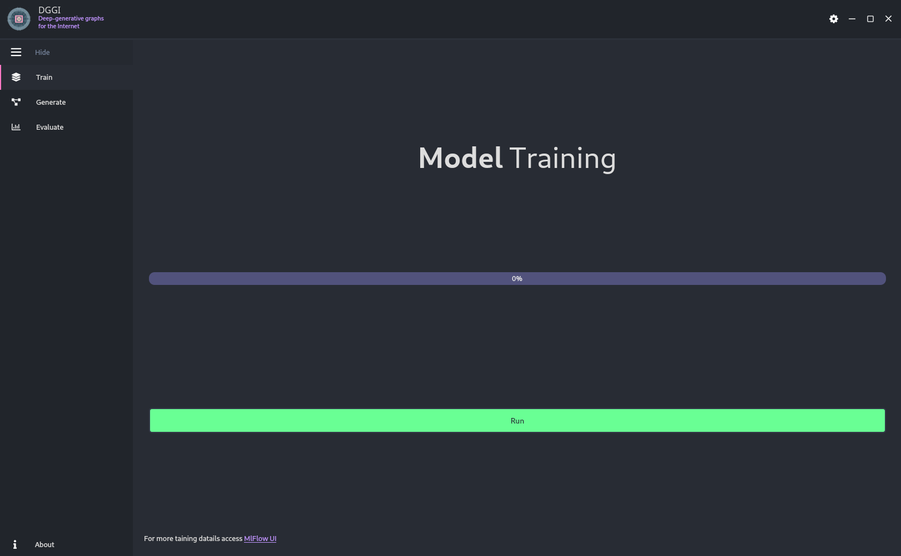

<p align="center">
 <br>
</p>

# Generator of Internet Intra Autonomous Systems Topology (Gen-AS)

Gen-AS is a software initially designed to synthesize graphs that reproduce the structure observed in intra-AS networks.
Under the hood, Gen-AS implements DGGI which uses the model [GraphRNN](https://arxiv.org/abs/1802.08773) to generate the synthetic graphs.
[MLflow](https://mlflow.org/) is used to track the
quality of training process and to save the best models, and [Hydra](https://hydra.cc/) is used to control the configuration parameters.
The pre-trained generator for intra-AS graphs synthesizing are provided [here](https://drive.google.com/file/d/1SavCRyWEzd1H48H39PUgtBWnAhrsExVe/view?usp=sharing), these training procedure uses the
dataset provided [here](https://drive.google.com/file/d/1ZwMlMz4lYZIp4BYxhccdyI3kYIQEDjSn/view?usp=sharing), which was introduced in the following paper:
```
title={Data-driven Intra-Autonomous Systems Graph Generator}
author={Caio Vinicius Dadauto and Nelson Luis Saldanha da Fonseca and Ricardo da Silva Torres}
year={2023}
eprint={2308.05254}
archivePrefix={arXiv}"
primaryClass={cs.NI}"
```

This software provides an easy way to:
1. train the model for any new graph dataset;
2. generate graphs based on a trained model;
3. evaluate different versions of generators;


## 1. Installation
DGGI installation relies on [poetry](https://python-poetry.org/) and [mamba](https://mamba.readthedocs.io/en/latest/index.html), both can be installed as follow:
```bash
curl -sSL https://install.python-poetry.org | python3 -
curl -L -O "https://github.com/conda-forge/miniforge/releases/latest/download/Mambaforge-$(uname)-$(uname -m).sh"
bash Mambaforge-$(uname)-$(uname -m).sh
```
for more details about this installation process.

Once `poetry` and `mamba` have been installed, in the root directory of this project, do
```bash
mamba env create -f environment.yaml
mamba activate gen_as
poetry install
```
This will install the required packages, add the default configuration file to `~/.config/dggi_dggm/config.yaml`,
and create two CLI commands `dggi` and `dggi-gui`.

## 2. Configuration
All runs of DGGI will consider the default configuration specified in `~/.config/dggi_dggm/config.yaml`, any modification
of this file will impact all runs of DGGI. To limit the scope of the configuration to a specific location, the default
configuration should be copied to this location, so, every time DGGI runs in this location, the copied configuration will be
considered, instead of default file in `~/.config/dggi_dggm`.

Moreover, the parameters can also be configured using the Graphical User Interface (GUI) directly. In the GUI,
the parameters can be verified and modified pressing the gear icon on the right corner of the interface, the figure below
illustrate this behavior.



The configuration parameters are detailed in the following sections.

### 2.1. For Hydra
| Parameter Name | Description                      | Default Value |
| -------------- | -------------------------------- | ------------- |
| `run.dir`        | Hydra default run directory      | "."           |
| `output_subdir`  | Location to persist Hydra output | null          | 

### 2.2. For MLflow
| Parameter Name | Description                    | Default Value |
| -------------- | ------------------------------ | ------------- |
| `exp_name`       | MLflow experiment name         | "DGGI         |
| `exp_tags`       | MLflow tags for the experiment | null          |
| `run_tags`       | MLflow tags for the run        | null          |
| `run_id`         | MLflow run ID                  | null          |

### 2.3. For Input Data
| Parameter Name | Description                                                                                                                                | Default Value |
| -------------- | ------------------------------------------------------------------------------------------------------------------------------------------ | ------------- |
| `num_workers`    | Number of threads used to load the data                                                                                                    | `4`           |
| `data_size`      | Total number of samples in the dataset                                                                                                     | `90326`       |
| `batch_size`     | The size of the batches used during the training                                                                                           | `40`          |
| `min_num_node`   | The number of nodes of the graph with smallest number of nodes in the dataset                                                              | `12`          |
| `max_num_node`   | The number of nodes of the graph with largest number of nodes in the dataset                                                               | `250`         |
| `max_prev_node`  | The maximum number of edge predictions that should be made for each incoming node. If `null`, DGGI will estimate this value automatically. | `250`         |
| `check_size`     | Check if the loaded graphs have the number of nodes between `min_num_node` and `max_num_node`                                              | `false`       |
| `inplace`        | If `true`, the graphs will not be loaded to the memory, otherwise, all graphs will be in-memory.                                           | `false`       |
| `source_path`    | The location of dataset.                                                                                                                   | `./data`      |


### 2.4. For the Model (GraphRNN)
| Parameter Name            | Description                                                                                      | Default Value |
| ------------------------- | ------------------------------------------------------------------------------------------------ | ------------- |
| `hidden_size_rnn`           | Hidden size for GRU for graph embedding. For small versions, 64 is recommended.                  | `128`           |
| `hidden_size_rnn_output`    | Hidden size for GRU for prediction connections.                                                  | `16`            |
| `embedding_size_rnn`        | The dimension of latent space of GRU for graph embedding. For small versions, 32 is recommended. | `64`            |
| `embedding_size_rnn_output` | The dimension of latent space of GRU for prediction connections.                                 | `8`             |
| `embedding_size_output`     | The dimension of latent space of MLP for the output. For small versions, 32 is recommended.      | `64`            |
| `num_layer`                 | The number of GRU layers.                                                                        | `4`             |


### 2.5. For Training
| Parameter Name      | Description                                                                                                                                               | Default Value |
| ------------------- | --------------------------------------------------------------------------------------------------------------------------------------------------------- | ------------- |
| `seed`                | The seed for random generator initial state.                                                                                                              | `12345`         |
| `num_epochs`          | Number of epochs.                                                                                                                                         | `1000`          |
| `epochs_test`         | The model will be evaluate for every `epochs_test` epochs.                                                                                                | `100`           |
| `epochs_test_start`   | Number of epochs to start considering the evaluation.                                                                                                     | `1`             |
| `test_batch_size`     | How many graphs will be generate per model iteration.                                                                                                     | `40`            |
| `test_total_size`     | How many graphs will be used for evaluation.                                                                                                              | `500`           |
| `lr`                  | Initial learning rate.                                                                                                                                    | `0.003`         |
| `lr_rate`             | The rating that the learning rate will be decreased for each milestone.                                                                                   | `0.3`           |
| `n_checkpoints`       | The number of model checkpoints to be persisted.                                                                                                          | `4`             |
| `milestones`          | A list of number of epochs used as milestones to control the learning rate decreasing.                                                                    | `[300, 500]`    |
| `n_bootstrap_samples` | The number of the test graphs should be sampled from test set.                                                                                            | `100`           |
| `metrics`             | A list of metrics that should be used during the evaluation. Possible metrics are: `degree`, `clustering`, `assortativity`, `betweenness`, and `pagerank` | `["degree"]`    |


### 2.6. For Generation
| Parameter Name  | Description                                                                                                                | Default Value     |
| --------------- | -------------------------------------------------------------------------------------------------------------------------- | ----------------- |
| `seed`            | The seed for random generator initial state.                                                                               | `12345`             |
| `test_batch_size` | How many graphs will be generate per model iteration.                                                                      | `40`                |
| `test_total_size` | How many graphs will be generated.                                                                                         | `500`               |
| `min_num_node`    | The minimum number of nodes required for the graphs to be generated. If `null`, uses the value defined for the input data. | `null`            |
| `max_num_node`    | The maximum number of nodes required for the graphs to be generated. If `null`, uses the value defined for the input data. | `null`            | 
| `save_dir`        | The location where the synthetic graphs will be saved.                                                                     | 'dggi_generation' |


### 2.7. For Evaluation
| Parameter Name  | Description                                                                                                                                               | Default Value                                                        |
| --------------- | --------------------------------------------------------------------------------------------------------------------------------------------------------- | -------------------------------------------------------------------- |
| `seed`            | The seed for random generator initial state.                                                                                                              | `12345`                                                                |
| `test_batch_size` | How many graphs will be generate per model iteration.                                                                                                     | `40`                                                                   |
| `test_total_size` | How many graphs will be used for evaluation.                                                                                                              | `500`                                                                  |
| `metrics`         | A list of metrics that should be used during the evaluation. Possible metrics are: `degree`, `clustering`, `assortativity`, `betweenness`, and `pagerank` | `["degree", "clustering", "assortativity", "betweenness", "pagerank"]` |


## 2. Usage
DGGI can be used either via command line or via user interface.


### 2.1. For Training
Every training process will require a graph dataset. For now,
the graphs must be in [gt](https://graph-tool.skewed.de/static/doc/gt_format.html) format.
Once the parameters are configured and the dataset located in the target location (`source_path`),
the training procedure can be started by either Command Line Interface (CLI) or Graphical User Interface (GUI).

During the training, the loss values for each epoch and the graph metrics for every evaluation can be veirfied
accessing the [MLflow interface](https://mlflow.org/docs/latest/quickstart.html#view-mlflow-runs-and-experiments).
This accessing can also be made via CLI and GUI. Using MLflow, information such as loss values, validation metrics, parameters set,
the model weights for different checkouts and for the best validated models as well will be persisted by MLflow.
All these information will be located in `./mlruns`.

#### 2.1.1. Command Line Interface
To train a model from scratch using the CLI, do
```bash
dggi train
```

The MLflow can be accessed using the following command:
```bash
mlflow ui
```


#### 2.1.2. Graphical User Interface
On terminal, do
```bash
dggi-gui
```

In the GUI, the tab for training on the left menu should be selected, then, press `Run`. The MLflow
interface can be opened through the hyper-link on the bottom of the training tab. The figure below, illustrate
this tab.



### 2.2. For Generation
The generation of synthetic graphs requires a trained model, i.e., a generator. This trained model should be located
as an experiment in the MLflow data located in `./mlruns`. For instance, the data required to synthesize intra-AS graphs
can be downloaded [here](https://drive.google.com/file/d/1SavCRyWEzd1H48H39PUgtBWnAhrsExVe/view?usp=sharing).

Once the parameters are configured and the data for the trained model is located in `./mlruns`,
the graph generation can be done via either CLI or GUI. All generated graphs will be persisted
in `./save_dir/<RUN_TIMESTAMP>`, note that the use of the run timestamp avoid the overwritten of
synthetic graphs from different runs.

#### 2.2.1. Command Line Interface
To generate synthetic graphs using a trained model, do
```bash
dggi generate
```

#### 2.2.2. Graphical User Interface
On terminal, do
```bash
dggi-gui
```

The tab for generation should be accessed on the left menu. On the center menu, select the generator to
be used and, then, press `Generate Graphs`.
The figure below, illustrate this tab.


The synthetic graphs can be visualize pressing `Visualization`. This will open a new window, in which a target directory
containing the synthetic graphs can be selected and these graphs can be visualized, the figure below gives an example of
this window.


### 2.3. For Evaluation
DGGI also provide a practical way to verify how realistic are the synthetic graphs
generate by a trained model. Similar to the generation, this evaluation requires the MLflow data
for a one trained model, at least. Moreover, the original data used for training should be in the same
location that they were during the training.

To estimate how realistic is a generator, DGGI analysis the Maximum Mean Discrepancy (MMD) for the graph metrics listed
in the parameter `evaluation.metrics`. More details about the MMD can be found in our [paper](https://arxiv.org/abs/2308.05254).

As for training and generation, the evaluation can be made via either CLI and GUI.

#### 2.2.1. Command Line Interface
To evaluate a previous trained model, do
```bash
dggi evaluate
```

All plots generate during the evaluation can be visualized through MLflow interface.

#### 2.2.2. Graphical User Interface
On terminal, do
```bash
dggi-gui
```

The tab for evaluation should be accessed on the left menu. On the center menu, select the generator to
be used and, then, press `Evaluate`.
The figure below, illustrate this tab.


The plots can be visualized pressing `Visualization`. This will open a new window, in which the different plots can be selected.
The figures below give three examples of the different plots that can be generated.


## Acknowledgement
* Logo:
* GraphRNN:
* GUI: 

## Citation
If you find this project useful, please cite
```
title={Data-driven Intra-Autonomous Systems Graph Generator}
author={Caio Vinicius Dadauto and Nelson Luis Saldanha da Fonseca and Ricardo da Silva Torres}
year={2023}
eprint={2308.05254}
archivePrefix={arXiv}"
primaryClass={cs.NI}"
```
